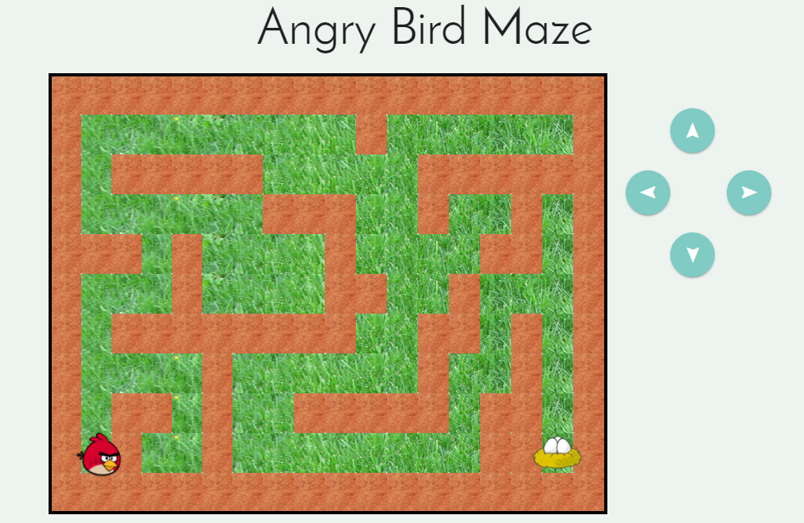

# Angry Bird Maze

Proyecto Final Sprint II To Do List

**1. HTML**
+ Título: "Angry Bird Maze"  El cual se realizo con un tamaño h1
+ Se añadieron 4 botones con estilos de la libreria Materialize para las direcciones
+ Se agrego un div *container* para seccionar el body según margin, border y padding de Materialize
+ Se agrego un div *tablero* en el cual se mostrara el laberinto
+ Se agregaron imágenes del nido y Red

**2. CSS**
+ Se uso para la colocación de de estilos de botones, fondo y diseño del laberinto.
+ Fuentes: tipo de letra usada "Josefin Sans"
+ Body Background: color de fondo "#edf4f0"
+ Body Color: color de letra "Black"
+ Buttom: Descripción de tamaño, color de fondo del botón y rotación del botón.
+ Se le enlazo la librería Materialize para dar un mejor aspecto

**3. JAVASCRIPT**
+ Se creo una función para generar el aberinto.
+ Se crearon los elementos del laberinto mediante JS.
+ Se usaron funciones para la captura de datos de posición y movimientos.

## Resultado
*Portada de entrada*

